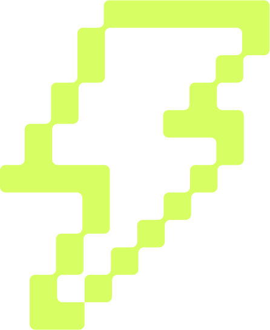

<!-- intentionally blank -->

TODO: Update html for presenting

------

# PEP736 & Keyword Args: Kudos or Approaching? 
<!-- .element: class="r-fit-text" -->
### Evan Kohilas
### `@ekohilas` - `nohumanerrors.com`

Hello everyone!

As someone who's passionate about working towards nohumanerrors.com,

------

<div class="r-stack">
    
    
</div>

I have utmost adoration for python's beautiful function argument system.

---
```python
def func(a, b):
    ...
```

Just look at it, isn't it great? Okay I'm not that crazy, ... at least I think.
Anyways, let's get some formalities out of the way. 

---
```python [2-3]
def func(
    a,
    b,
):
    ...
```

Anyone know what the name of these are called?

Anyone else thought they were called arguments?
Yeah it still confuses me...

---
```python [8-9]
def func(
    a,
    b,
):
    ...
    
func(
    a, 
    b, 
)
```

Okay so anyone want to take a guess at what these are called?

Anyone know what the name of these are?

Yeah these are arguments!

---
```python
def func(
    a,
    b,
):
    ...
    
func(
    a, 
    b, 
)
```

Okay now that that's out of the way let's go back to python's beautiful function argument system, that maybe I am crazy for...

---
```java
void rectangle(
    int width,
    int height,
);
```

I'll show this by example in comparison to most other languages. Here we have a function.

---
```java [6]
void rectangle(
    int width,
    int height,
);

basic_rectangle = rectangle(10, 20);
```
And we can call it to create a basic rectangle of a particular width and height.

```java
void rectangle(
    int width,
    int height,
);

basic_rectangle = rectangle(10, 20);
```
Now let's say that a basic rectangle isn't good enough, and we need to create a rotated one instead.

> TODO: Change type signature of rectangle

---
```java [4]
void rectangle(
    int width,
    int height,
    int rotation
);

basic_rectangle = rectangle(10, 20);
```

And to do so, we need to add the rotation paramter.

---
```java [7]
void rectangle(
    int width,
    int height,
    int rotation
);

basic_rectangle = rectangle(10, 20);
```
But now our previous function needs to be updated.

---
```java [7]
void rectangle(
    int width,
    int height,
    int rotation
);

basic_rectangle = rectangle(10, 20, 0);
```
And this creates a problem, because we now need to go through and update all existing function calls to specify a default rotation of 0.

```java
void rectangle(
    int width,
    int height,
    int rotation
);

basic_rectangle = rectangle(10, 20, 0);
```
But in most of these languages, there are other ways that a default rotation can be setup, so that this can be avoided.

------
```java
void rotated_rectangle(
    int width,
    int height,
    int rotation
);

void rectangle(
    int width,
    int height
) {
    rotated_rectangle(width, height, 0);
}
```
> TODO: Split
> TODO: Too wordy
And that is by creating a new function `rotated_rectangle` with this rotation parameter, and updating the old `rectangle` function, such that it calls the new `rotated_rectangle` function while setting the new `rotation` parameter with a default argument, which in our case will be 0.

Now you can start to see how this might get a bit messy. The good news it, that this messyness can be avoided through the use of function overloading.

------
```java
void rectangle(
    int width,
    int height
) {
    rectangle(width, height, 0);
}
```
This is function overloading, and it removes the need for us to rename any functions, as these programming languages will determine which functions to call using the parameter types instead.

That being said, this can also become problematic, for reasons that will become more apparrant later.

> as you can have multiple indetically named functions that may all do different things. Calling with the wrong arguments that have the same type but different names


------
```python [4]
def rectangle(
    width,
    height,
):
    ...

normal = rectangle(width, height)
```

So now if we switch back to Python,
So how does Python do it?

------
```python [4]
def rectangle(
    width,
    height,
    rotation=0,
):
    ...

normal = rectangle(width, height)
rotated = rectangle(width, height, rotation)
```

Well in python, since the concept of default arguments is built into the lanaguage (using the equals sign in the parameter definition)

------
```python [8-9]
def rectangle(
    width,
    height,
    rotation=0,
):
    ...

normal = rectangle(width, height)
rotated = rectangle(width, height, rotation)
```

there's no need for chained overloads, because if we don't specify a rotation, we've told it default to 0 instead.

------
```python
def rectangle(
    width,
    height,
    rotation=0,
):
    ...

normal = rectangle(width, height)
rotated = rectangle(width, height, rotation)
```

As a side note, Python is not perfect in this case either (I don't think any language is!)

And I highlight that because of one detail that can be easily missed.

------
```python
def rectangle(
    width,
    height,
    metadata={},
):
    ...
```

Let's say for example, that we wanted to set a default argument for our rectangles to contain metadata based on how they were created.

------
```python
def rectangle(
    width,
    height,
    metadata={},
):
    metadata["width"] = width
    metadata["height"] = height
```

And then, we added that metadata within the function.

------
```python
def rectangle(
    width,
    height,
    metadata={},
):
    metadata["width"] = width
    metadata["height"] = height
    
small = rectangle(10, 20)
big = rectangle(200, 100)
print(small.metadata) # {"width": 10, "height": 20"}
print(big.metadata)   # {"width": 200, "height": 100"}
```

What you'll find, is that instead of the obvious answer that you'd expect when printing this metadata

------
```python [11-12]
def rectangle(
    width,
    height,
    metadata={},
):
    metadata["width"] = width
    metadata["height"] = height
    
small = rectangle(10, 20)
big = rectangle(200, 100)
print(small.metadata) # {"width": 200, "height": 100"}
print(big.metadata)   # {"width": 200, "height": 100"}
```

Instead, their metadata is the same.

That's because these default parameters are instantiated at the time the function is defined, instead of when the function is called.

Giving this strange outcome, where all functions are sharing the same state.

------
```python [8-9]
def rectangle(
    width,
    height,
    rotation=0,
):
    ...

normal = rectangle(width, height)
rotated = rectangle(width, height, rotation)
```

Now if we step back to our original example, those of you that are experienced might be thinking of another way of how default arguments are usually done. 
> TODO: Code example
> TODO: Link all code
> TODO: Finalise code examples
> TODO: Add highlighting to code examples 
> TODO: Add code example replacing width/height with param1, param2, arg1, arg2

---
```java
Rectangle.builder(height, width)
    .build();
 
```
<!-- .element: data-notrim -->

And that is through a programming construct called the builder pattern, which stores and create this state.

---
```java
Rectangle.builder(height, width)
    .withRotation(rotation)
    .build();
```

This resolves this issue by allowing for optionally added data.

------
```java
Rectangle.builder(height, width)
    .build();
 
```
<!-- .element: data-notrim -->

But yet another issue lies, due to the nature of these **required** ordered arguments.
And that is that there's no knowing whether the arguments are set correctly 

------
<!-- .element: data-auto-animate -->
```java
Rectangle.builder(height, width)
    .build();
  
```
<!-- .element: data-notrim -->
<!-- .element: data-id="builder" -->

For example, put your hand up, if you noticed, that when I defined this builder, the ordering of height and width were swapped?

(Pause to look)

Even with [so many] people in this audience, there's actually only [a few] of you that realised that it should be width and height,

------
<!-- .element: data-auto-animate -->
```java [1,5,6]
Rectangle.builder(height, width)
    .build();
 
void rectangle(
    int width,
    int height
);
```
<!-- .element: data-id="builder" -->

Not height and width.
(3s pause for effect)

---
```python
rectangle(
    width=width,
    height=height,
)
```

Python is beautiful, in that it solves this with keyword arguments (and thus also does away with builders)

------
```python
rectangle(
    width=1,
    height=2,
)
```

Meaning that not only are our functions self documenting by having constant arguments labelled

------
```python
rectangle(
    height=2,
    width=1,
)
```

But now our argument ordering is redundant!

------
```python
rectangle(
    width=width,
    height=height,
)
```

Thus, by always using keyword arguments, our code is always future proofed against errors,

---
<!-- .element: data-auto-animate -->
```python []
def rectangle(
    height,
    width,
    rotation=0,
):
    ...

    
rectangle(1, 2, 3,)
```
<!-- .element: data-id="rectangle" -->

Like for example, if we go back to a default argument being used for rotation

------
<!-- .element: data-auto-animate -->
```python [9-13]
def rectangle(
    height,
    width,
    rotation=0,
):
    ...

    
rectangle(
    1,
    2,
    3,
)
```
<!-- .element: data-id="rectangle" -->

then we could call that function,

------
```python [12]
def rectangle(
    height,
    width,
    rotation=0,
):
    ...

    
rectangle(
    1, # height
    2, # width
    3, # rotation
)
```

with the 3rd argument overriding that default.

------
```python [4]
def rectangle(
    height,
    width,
    opacity,
    rotation=0,
):
    ...
    
rectangle(
    1,
    2,
    3,
)
```

But once we introduce a new required positional argument like opacity

------
```python [9-13]
def rectangle(
    height,
    width,
    opacity,
    rotation=0,
):
    ...
    
rectangle(
    1, # height
    2, # width
    3, # rotation
)
```

where 1, 2, and 3 were previously for height, width, and rotation

------
```python [12]
def rectangle(
    height,
    width,
    opacity,
    rotation=0,
):
    ...
    
rectangle(
    1, # height
    2, # width
    3, # opacity
)
```

They're now actually for height, width, and opacity, without us ever knowing.

------
```python [10-12]
def rectangle(
    height,
    width,
    opacity,
    rotation=0,
):
    ...
    
rectangle(
    height=1,
    width=2,
    opacity=3,
)
```

Naming our arguments easily lets us prevent this issue!

---
```python []
def rectangle(
    height,
    width,
    opacity,
    rotation=0,
):
    ...
    
rectangle(
    height=1,
    width=2,
    opacity=3,
)
```

But in addition, also reduces issues with refactoring!

------
```python [2-3]
def rectangle(
    width,
    height,
    opacity,
    rotation=0,
):
    ... 
    
rectangle(
    height=1,
    width=2,
    opacity=3,
)
```

such as in the case where we want to fix the mis-ordered parameters,

------
```python [10-11]
def rectangle(
    width,
    height,
    opacity,
    rotation=0,
):
    ...
    
rectangle(
    height=1,
    width=2,
    opacity=3,
)
```

we now don't have to make changes to re-order those arguments where that function is called.

---

<!-- .element: data-auto-animate -->
```python []
def rectangle(
    height,
    width,
):
    ...
    
rectangle(
    1, # height
    2, # width
)
```
<!-- .element: data-id="named" -->

If you are convinced by keyword arguments, then there is a way to force using them,

------
<!-- .element: data-auto-animate -->
```python [2]
def rectangle(
    *,
    height,
    width,
):
    ...
    
rectangle(
    1, # height
    2, # width
)
```
<!-- .element: data-id="named" -->

and that is by putting `*` as the first parameter,

------
<!-- .element: data-auto-animate -->
```python [13-]
def rectangle(
    *,
    height,
    width,
):
    ...
    
rectangle(
    1, # height
    2, # width
)

Traceback (most recent call last):
  File "<stdin>", line 1, in <module>
TypeError: rectangle() takes 0 positional arguments but 2 were given
```
<!-- .element: data-id="named" -->

which will throw us an error when we try to call the function without naming our arguments.

But that can be cumbersome, as it can be forgotten, can make the code noisy, and would also require updating all previous functions.

---
<!-- .element: data-auto-animate -->
```python [8-9]
def rectangle(
    height,
    width,
):
    ...
    
rectangle(
    height=height,
    width=width,
)
```
<!-- .element: data-id="named" -->

Not to mention the redundant case where the names of the variables being passed in are the same as the parameters.

---
<!-- .element: data-auto-animate -->
```python [8-10]
def rectangle(
    height,
    width,
):
    ...
    
rectangle(
    # PEP736
    height=,
    width=,
)
```
<!-- .element: data-id="named" -->

The good news is, for when we don't have control over the interface, PEP736 is currently debating either using something like a trailing = for arguments that should take from variable names

------
<!-- .element: data-auto-animate -->
```python [8-10]
def rectangle(
    height,
    width,
):
    ...
    
rectangle(
    *, # PEP736
    height,
    width,
)
```
<!-- .element: data-id="named" -->

or adding `*` as an argument, for every argument afterwards to do the same.

------
<!-- .element: data-auto-animate -->
```python [8-9]
def rectangle(
    height,
    width,
):
    ...
    
rectangle(
    height,
    width,
)
```
<!-- .element: data-id="named" -->

Personally I feel like the best approach is for this sugar to be enabled and checked by default,

------
<!-- .element: data-auto-animate -->

```python [2, 9-10]
def rectangle(
    *,
    height,
    width,
):
    ...
    
rectangle(
    height,
    width,
)
```
<!-- .element: data-id="named" -->

or at the least, have `*` in the function definition specify that, that can be the case.

But given the way Python has been built, it might not be currently possible.

------


So until something changes, I personally feel that linters are a cleaner, more pragmatic way to not only check, but also correct this for us!

---
<!-- .element: data-background-image="images/sprints.svg"-->

> TOOD: Update image to repo
> TODO: Could expand? e.g. this is because these lint rules can analyse the definitions during the calls of functions

So if this excites you, come contribute on making this lint rule a reality!

------

Or, if I've influenced you enough to start using this paradigm in your code day to day, here are some things that may be worth noting. 

------
```python
range(
    start=0,
    stop=10
    skip=2
)   
```

For one, you may notice in your excitement to add the parameter names as keyword arguments to all your function calls...

------
```python
>>> range(start=0, stop=1, skip=2)
Traceback (most recent call last):
  File "<stdin>", line 1, in <module>
TypeError: range() takes no keyword arguments

```

that not _all_ functions are happy with that.

------
This is because of another special parameter, unlike `*` which makes all further parameters keyword only, 


------
`/` prevents all previous parameters from being passed with keywords.

------

# <br> 
<!-- .element: style="max-height: 95%"-->
<!-- .element: class="r-stretch"-->
# `pep736.nohumanerrors.com`
# `@ekohilas`

Or if you can't make it, you can find me online at @ekohilas, or collaborate with me on nohumanerrors.com.

------

# Thanks! 
<!-- .element: style="max-height: 95%"-->
<!-- .element: class="r-stretch"-->
# `pep736.nohumanerrors.com`
# `@ekohilas`

Thanks to Joshua and Chris for authoring the PEP, and to you for listening!


------
One issue with this approach, is that you may realise that not all functions allow keyword arguments.

This is because of the `/` parameter syntax
